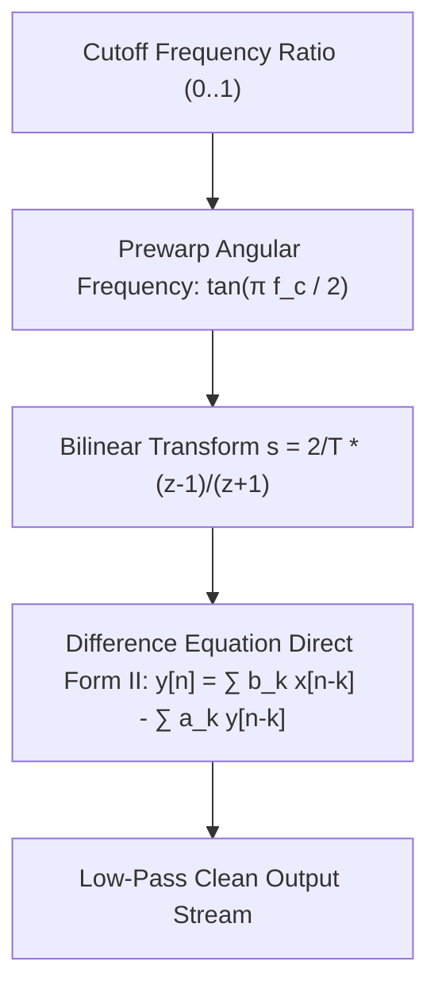

# Butterworth IIR Filter Skill

Second-order maximally flat magnitude low-pass Infinite Impulse Response (IIR) filter designed using the Bilinear Transform.

## Features
- **100% Python Standard Library**: Pure difference equation direct form evaluation.
- **Maximally Flat Passband**: No passband ripples (unlike Chebyshev or Elliptic filters).
